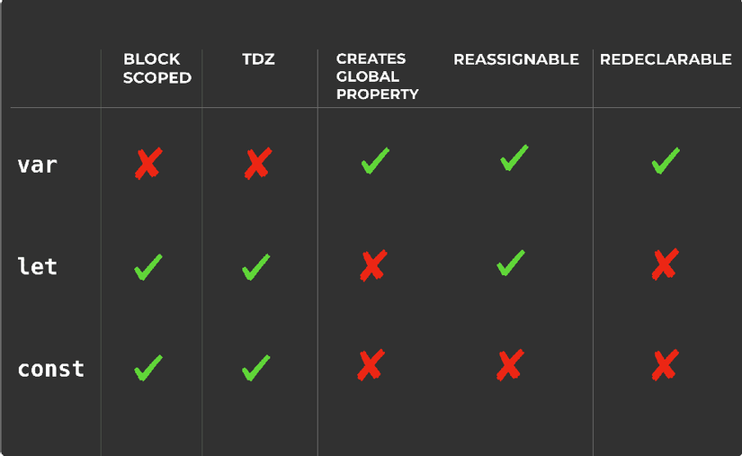

# Variables and Operator

## Variables (`var`, `let`, `const`)

`var` có thuộc tính cục bộ `(scope global)` khi khai báo trong `block` và sử dụng ngoài `block` đó. Tuy nhiên, nếu khai báo trong 1 `function` thì sẽ có `scope function` hoặc `scope local` nên truy cập bên ngoài sẽ báo lỗi.

```js
// Ví dụ scope global và scope block

if (true) {
  var foo = "foo!";
}

console.log(foo); // > foo!

(function () {
  var bar = "bar!";
})();

console.log(bar); // Uncaught ReferenceError: bar is not defined
```

Thử nghiệm với `let`

```js
for (let i = 0; i < 10; i++) {
  console.log(`Inside number ${i}`);
}
console.log(`Outside number ${i}`);
```

Result:

```js
>
Inside number 0
Inside number 1
Inside number 2
Inside number 3
Inside number 4
Inside number 5
Inside number 6
Inside number 7
Inside number 8
Inside number 9
> console.log(`Outside number ${i}`);
Uncaught ReferenceError: i is not defined
```

Khi sử dụng `var`

```js
for (var i = 0; i < 10; i++) {
  console.log(`Inside number ${i}`);
}
console.log(`Outside number ${i}`);
```

Result:

```js
>
Inside number 0
Inside number 1
Inside number 2
Inside number 3
Inside number 4
Inside number 5
Inside number 6
Inside number 7
Inside number 8
Inside number 9
> console.log(`Outside number ${i}`);
Outside number 10
```

> `let` có thuộc tính chỉ tồn tại trong 1 `block` (`block` trong javascript được phân tách bằng một cặp dấu ngoặc nhọn `{}`)

### Creating global properties (tạo thuộc tính global)

```js
var counterVar = 0;
console.log(window.counter); //  0

let counterLet = 0;
console.log(window.counter); // undefined

const counterConst = 0;
console.log(window.counterCnt); // undefined
```

### Redeclaration (Khai báo lại)

```js
var counterVar = 10;
var counterVar;
console.log(counterVar); // 10

let counterLet = 10;
let counterLet; // Uncaught SyntaxError: Identifier 'counterLet' has already been declared

var foo = "Hi";
let bar = "Hello";
const mickey = "kimsohyun";

var foo = "Hi 2";
let bar = "Hello 2"; // Uncaught SyntaxError: Identifier 'bar' has already been declared
const mickey = "kimsohyun 2";
```

### Assignment

```js
var foo;
let bar;
console.log(foo, bar); // undefined undefined

const dontValue; // Uncaught SyntaxError: Missing initializer in const declaration
```

về `const` khi khai báo sử dụng bạn sẽ không thể thay đổi giá trị của nó. Tuy nhiên, với Object thì chúng ta sẽ thay đổi được giá trị từ biến bên trong object đó

```js
const obj = {
  name: "foo",
};

obj.name = "bar";
console.log(obj.name);
```

# Operator

## Arithmetic Operators (`+`,`-`, `*`, `/`, `**`, `++`, `--`, `%`)

## Assignment Operators (`=`,`+=`, `-=`, `*=`, `/=`, `%=`, `**=`)

## JavaScript String Operators

## Adding Strings and Numbers

## JavaScript Comparison Operators

## JavaScript Logical Operators

| Operator | Description | Example                       |
| -------- | ----------- | ----------------------------- |
| &&       | and         | (x < 10 && y > 1) is true     |
| \|\|     | or          | (x == 5 \|\| y == 5) is false |
| !        | not         | !(x == y) is true             |

```js
let a;
a || ""; // ""
let b = 5;
a || ""; // 5
```

## JavaScript Type Operators

# SUMARY



# REF

1. https://suntech.edu.vn/phan-biet-let-const-va-var-trong-javascript.sunpost.html
1. https://www.w3schools.com/js/js_operators.asp
